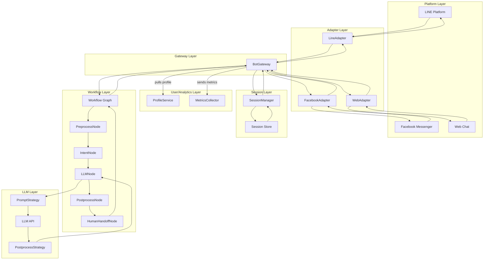

<!-- llm-chatbot/
├── app.py                            # จุดเริ่มต้นของแอปฯ สำหรับรับข้อความและส่งเข้า workflow graph
├── config/
│   ├── settings.py                   # เก็บ environment variables, API key, config ทั่วไป
│   └── workflow_default.yaml         # ไฟล์ config สำหรับนิยาม workflow graph (node/edge/condition)
├── adapters/
│   ├── line_adapter.py               # logic สำหรับรับ/ส่งข้อความกับ LINE (webhook, reply, format)
│   └── platform_base.py              # base class/interface สำหรับรองรับ platform อื่นๆ ในอนาคต
├── bot_gateway/
│   └── gateway.py                    # orchestration layer: ประสานงานระหว่าง adapter, session, workflow
├── session/
│   ├── session_manager.py            # จัดการโหลด/บันทึก session & context ของแต่ละ user
│   ├── store_redis.py                # ตัวอย่าง backend สำหรับ session (ใช้ Redis)
│   └── context_schema.py             # โครงสร้างข้อมูล context ที่ใช้วนใน workflow
├── llm/
│   ├── llm_service.py                # รวม logic เรียก LLM pipeline (prompt, postprocess)
│   ├── prompt_strategy.py            # สร้าง prompt template ตาม use case
│   ├── postprocess_strategy.py       # จัดการ postprocess เช่น enrich, format, translation
│   └── llm_api.py                    # เรียกใช้งาน LLM engine (OpenAI, Local, ฯลฯ)
├── user/
│   └── profile_service.py            # ดึงและจัดการ user profile (display name, picture, ฯลฯ)
├── utils/
│   ├── logger.py                     # logging utility สำหรับ debug และ monitoring
│   └── event_bus.py                  # pub/sub หรือ observer สำหรับ event ต่างๆ (analytics, handoff)
├── analytics/
│   └── metrics_collector.py          # เก็บ/ส่ง metrics, event, user engagement สำหรับ dashboard
├── workflow/
│   ├── graph_loader.py               # โหลดและสร้าง workflow graph จากไฟล์ config (YAML)
│   ├── nodes/
│   │   ├── __init__.py
│   │   ├── preprocess_node.py        # node สำหรับ preprocess ข้อความ (clean, normalize)
│   │   ├── intent_node.py            # node สำหรับ intent classification (หาเจตนา user)
│   │   ├── llm_node.py               # node สำหรับเรียก LLM model
│   │   ├── postprocess_node.py       # node สำหรับ postprocess ข้อความก่อนส่งกลับ user
│   │   └── human_handoff_node.py     # node สำหรับ human handoff (เชื่อมต่อเจ้าหน้าที่)
├── requirements.txt                  # รายการ python dependency ทั้งหมดที่ใช้
└── tests/
    └── test_workflow_graph.py        # unit test สำหรับ workflow graph และแต่ละ node
หมายเหตุ
	•	โฟลเดอร์ workflow/nodes/: เพิ่ม node ใหม่ได้ง่าย เช่น profanity_check_node.py, db_lookup_node.py	•	config/workflow_default.yaml: ปรับ flow ได้โดยไม่ต้องแก้โค้ด (เพิ่ม/ลด node, branching)	•	session/: รองรับ context-aware, multi-turn, หรือ personalized bot	•	adapters/: รองรับหลาย platform ได้ในอนาคต	•	llm/: แยก logic LLM ออกจาก workflow, ทำให้เปลี่ยน model หรือ provider ได้ง่าย	•	analytics/: ต่อยอดทำ dashboard, monitor, หรือ A/B test ได้ -->

uv run python main.py