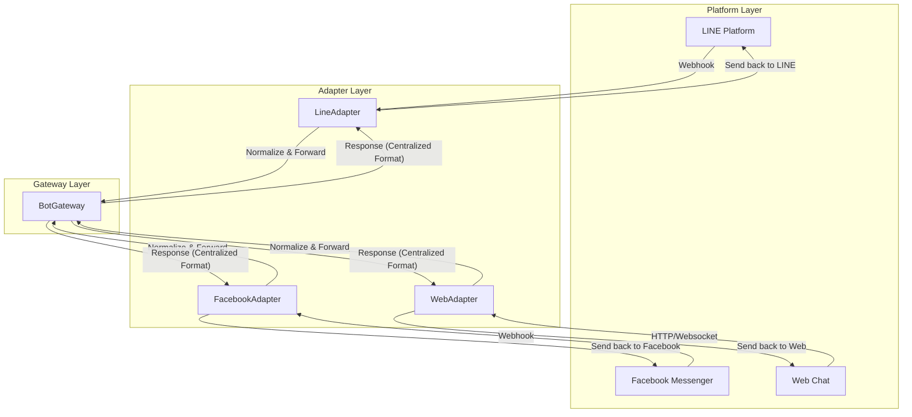

# Adapter and Platform Functions Documentation

## Overview

The chat-chat system uses a modular adapter pattern to support multiple messaging platforms (LINE, Facebook, Web, Telegram). This document provides comprehensive documentation for the adapter and platform function architecture.

## Architecture

### Core Components

1. **PlatformAdapter (Abstract Base Class)** - `/adapters/base/platform_base.py`
2. **LineAdapter (Implementation)** - `/adapters/platforms/line_adapter.py`
3. **Platform Models** - `/models/platform.py`

### Design Pattern

The system follows the **Adapter Pattern** to provide a unified interface for different messaging platforms while handling platform-specific implementation details internally.

## PlatformAdapter Base Class

### Purpose
Abstract base class that defines the contract for all platform adapters, ensuring consistent behavior across different messaging platforms.

### Core Functions

#### `__init__(self, config: AdapterConfig)`
**Purpose**: Initialize adapter with platform-specific configuration
- **Parameters**: 
  - `config`: Platform configuration containing credentials and settings
- **Sets**: `self.config` and `self.platform` attributes

#### `parse_incoming(self, webhook_data: dict[str, Any]) -> IncomingMessage | None`
**Purpose**: Parse platform-specific webhook data into normalized message format
- **Parameters**:
  - `webhook_data`: Raw webhook payload from platform
- **Returns**: `IncomingMessage` object or `None` if parsing fails
- **Abstract**: Must be implemented by each platform adapter

#### `format_outgoing(self, message: OutgoingMessage, user: User) -> dict[str, Any]`
**Purpose**: Convert normalized outgoing message to platform-specific format
- **Parameters**:
  - `message`: Normalized outgoing message
  - `user`: Target user information
- **Returns**: Platform-specific message format
- **Abstract**: Must be implemented by each platform adapter

#### `send_message(self, formatted_message: dict[str, Any], user: User) -> bool`
**Purpose**: Send formatted message to platform API
- **Parameters**:
  - `formatted_message`: Platform-specific formatted message
  - `user`: Target user
- **Returns**: `True` if successful, `False` otherwise
- **Abstract**: Must be implemented by each platform adapter

#### `get_user_profile(self, platform_user_id: str) -> User | None`
**Purpose**: Retrieve user profile from platform API
- **Parameters**:
  - `platform_user_id`: Platform-specific user identifier
- **Returns**: `User` object with profile data or `None` if not found
- **Abstract**: Must be implemented by each platform adapter

#### `validate_webhook(self, headers: dict[str, str], body: bytes) -> bool`
**Purpose**: Validate incoming webhook request authenticity
- **Parameters**:
  - `headers`: HTTP headers from webhook request
  - `body`: Raw request body bytes
- **Returns**: `True` if valid, `False` otherwise
- **Abstract**: Must be implemented by each platform adapter

### Utility Functions

#### `generate_user_id(self, platform_user_id: str) -> str`
**Purpose**: Generate normalized user ID from platform-specific ID
- **Parameters**: `platform_user_id` - Platform-specific user ID
- **Returns**: Normalized ID in format: `user_{platform}_{platform_user_id}`
- **Location**: `platform_base.py:99`

#### `generate_message_id(self, platform_message_id: str) -> str`
**Purpose**: Generate normalized message ID from platform-specific ID  
- **Parameters**: `platform_message_id` - Platform-specific message ID
- **Returns**: Normalized ID in format: `msg_{platform}_{platform_message_id}`
- **Location**: `platform_base.py:111`

## LineAdapter Implementation

### Purpose
Concrete implementation of PlatformAdapter for LINE messaging platform integration.

### Initialization

#### `__init__(self, config: LineConfig)`
**Purpose**: Initialize LINE adapter with LINE-specific configuration
- **Parameters**: `config` - LINE configuration with access token and secret
- **Sets up**: LINE Messaging API client for sending messages
- **Location**: `line_adapter.py:23`

### Core Function Implementations

#### `parse_incoming(self, webhook_data: dict[str, Any]) -> IncomingMessage | None`
**Purpose**: Parse LINE webhook events into normalized messages
- **Handles**: Text, image, video, audio, file, location, and sticker messages
- **Process**:
  1. Extract events from webhook payload
  2. Validate event type (only "message" events processed)
  3. Extract user ID and message data
  4. Generate normalized IDs
  5. Determine message type and content
  6. Create `IncomingMessage` object
- **Error Handling**: Returns `None` on parsing failure
- **Location**: `line_adapter.py:36`

#### `format_outgoing(self, message: OutgoingMessage, user: User) -> dict[str, Any]`
**Purpose**: Format normalized message for LINE API
- **Currently Supports**: Text messages only
- **Returns**: LINE message format `{"type": "text", "text": message.text}`
- **Fallback**: Unsupported message types return error text
- **Location**: `line_adapter.py:112`

#### `send_message(self, formatted_message: dict[str, Any], user: User) -> bool`
**Purpose**: Send message to LINE user via LINE Messaging API
- **Process**:
  1. Extract reply token from user platform data
  2. Create LINE message object (TextMessage)
  3. Build ReplyMessageRequest
  4. Send via LINE Messaging API
- **Requirements**: Reply token must be present in user.platform_data
- **Error Handling**: Returns `False` on failure, logs errors
- **Location**: `line_adapter.py:132`

#### `get_user_profile(self, platform_user_id: str) -> User | None`
**Purpose**: Retrieve LINE user profile (basic implementation)
- **Current Implementation**: Creates basic User object with default profile
- **Production Note**: Should call LINE Profile API for real user data
- **Returns**: User object with basic profile information
- **Location**: `line_adapter.py:173`

#### `validate_webhook(self, headers: dict[str, str], body: bytes) -> bool`
**Purpose**: Validate LINE webhook signature for security
- **Process**:
  1. Extract x-line-signature header
  2. Create HMAC-SHA256 hash using channel secret
  3. Base64 encode the hash
  4. Compare with provided signature using constant-time comparison
- **Security**: Uses `hmac.compare_digest()` to prevent timing attacks
- **Location**: `line_adapter.py:207`

## Platform Models

### PlatformType Enum
**Purpose**: Define supported messaging platforms
- **Values**: `LINE`, `FACEBOOK`, `WEB`, `TELEGRAM`
- **Location**: `platform.py:11`

### AdapterCapabilities
**Purpose**: Define what features each platform supports
- **Properties**: Text, images, video, audio, files, location, stickers, quick replies, rich menus
- **Limits**: Max text length, max file size
- **Location**: `platform.py:20`

### AdapterConfig
**Purpose**: Base configuration for platform adapters
- **Core Fields**: `platform`, `enabled`, `webhook_path`
- **Authentication**: `access_token`, `secret_key`, `verify_token`
- **Capabilities**: Platform feature support
- **Location**: `platform.py:36`

### LineConfig
**Purpose**: LINE-specific adapter configuration
- **Inherits**: `AdapterConfig`
- **LINE Fields**: `channel_access_token`, `channel_secret`
- **Default Capabilities**: Full LINE feature support with 5000 char limit, 10MB file limit
- **Location**: `platform.py:60`

## Message Flow Architecture

### Incoming Message Flow
1. **Webhook Reception**: Platform sends webhook to `/webhook/{platform}`
2. **Signature Validation**: `validate_webhook()` verifies request authenticity
3. **Message Parsing**: `parse_incoming()` converts to normalized format
4. **Processing**: Business logic processes normalized message
5. **Response Generation**: Create `OutgoingMessage` response

### Outgoing Message Flow
1. **Message Creation**: Business logic creates `OutgoingMessage`
2. **Formatting**: `format_outgoing()` converts to platform format
3. **Delivery**: `send_message()` sends via platform API
4. **Status Tracking**: Return success/failure status

## Security Considerations

### Webhook Validation
- **LINE**: HMAC-SHA256 signature validation using channel secret
- **Process**: Compare computed hash with provided signature
- **Protection**: Prevents webhook spoofing and replay attacks

### Token Management
- **Access Tokens**: Stored in configuration, used for API calls
- **Reply Tokens**: Short-lived tokens from webhooks for message replies
- **Secrets**: Used for webhook signature validation

## Error Handling

### Graceful Degradation
- **Parse Failures**: Return `None`, log error details
- **Send Failures**: Return `False`, maintain system stability
- **API Errors**: Catch exceptions, log for debugging

### Logging Strategy
- **Parse Errors**: Log webhook parsing failures with context
- **Send Errors**: Log message delivery failures with error details
- **Validation Errors**: Log security validation failures

## Extension Points

### Adding New Platforms
1. Create new adapter class inheriting from `PlatformAdapter`
2. Implement all abstract methods for the platform
3. Create platform-specific configuration class
4. Add platform type to `PlatformType` enum
5. Register adapter in the routing system

### Extending Message Types
1. Update `MessageType` enum with new types
2. Modify `parse_incoming()` to handle new types
3. Update `format_outgoing()` to format new types
4. Add capability flags to `AdapterCapabilities`

## Best Practices

### Configuration
- Use environment variables for sensitive credentials
- Validate configuration on startup
- Provide clear error messages for missing config

### Error Handling
- Never expose internal errors to external systems
- Log sufficient detail for debugging
- Implement circuit breakers for external API calls

### Performance
- Cache user profiles when possible
- Implement rate limiting for API calls
- Use async/await for I/O operations

### Security
- Always validate webhook signatures
- Use constant-time comparison for security checks
- Sanitize user input before processing
- Implement proper authentication token management
 