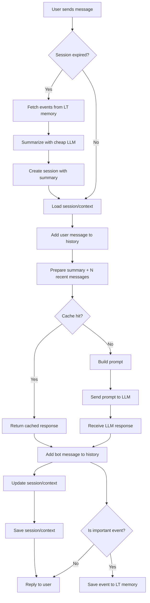

คำอธิบาย node เพิ่มเติม (mapping สำหรับ multi-tenant)

### Node Descriptions

* **User sends message**: รับ message พร้อมข้อมูล shop_id, user_id
* **Session expired?**: ตรวจสอบ session key = shop_id:user_id
* **Fetch events from LT memory**: ดึง important events ของ shop_id, user_id
* **Summarize with cheap LLM**: สรุป event/history ด้วย LLM ราคาถูก
* **Create session with summary**: สร้าง session context ใหม่ (shop_id, user_id)
* **Load session/context**: โหลด session/context เดิม (shop_id, user_id)
* **Add user message to history**: เพิ่มข้อความ user ลงใน history
* **Prepare summary + N recent messages**: เตรียมข้อมูลสำหรับ prompt
* **Cache hit?**: เช็ค cache (key = shop_id:user_id:context)
* **Return cached response**: ถ้ามี response เดิมใน cache
* **Build prompt**: สร้าง prompt (inject config, knowledge, policy ของร้าน)
* **Send prompt to LLM**: ส่ง prompt เข้า LLM
* **Receive LLM response**: รับผลลัพธ์จาก LLM
* **Add bot message to history**: เพิ่มข้อความ bot ลงใน history
* **Update session/context**: อัปเดต context
* **Save session/context**: บันทึก session/context
* **Reply to user**: ส่งข้อความกลับ user ที่ร้านค้านั้น
* **Is important event?**: ตรวจสอบ event สำคัญ (ตาม config ร้าน)
* **Save event to LT memory**: เก็บ event ลง LT memory (shop_id, user_id)
