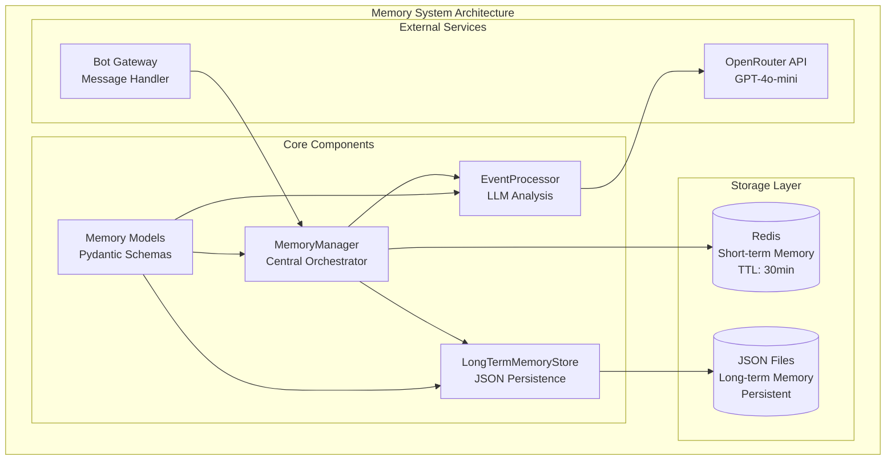
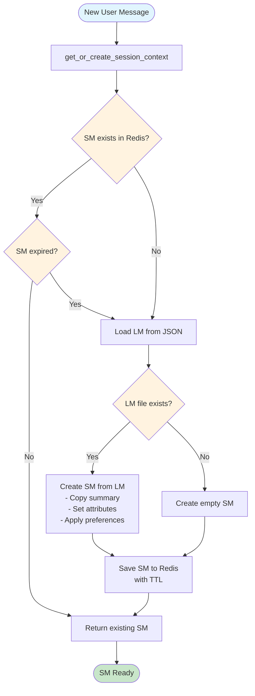
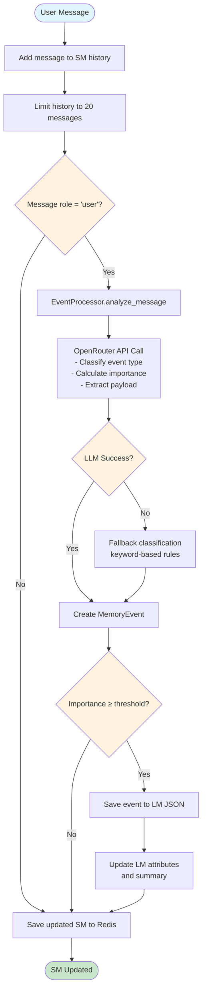
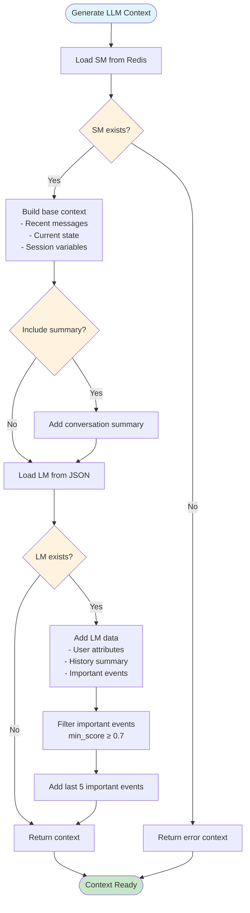
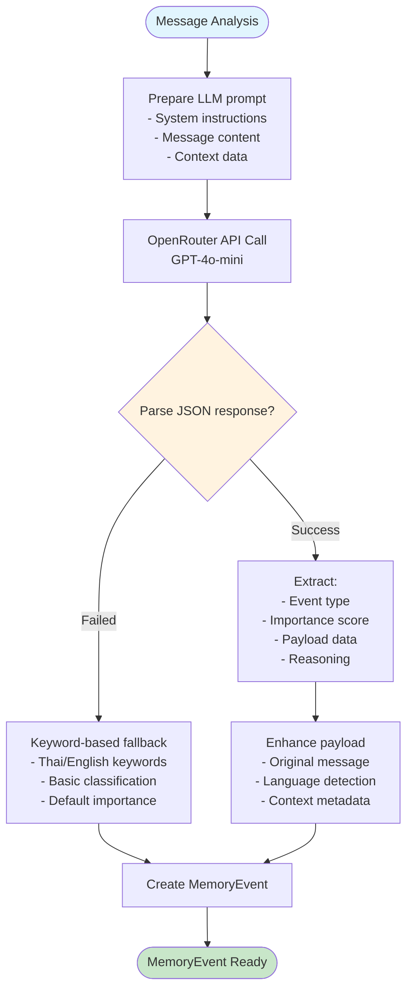
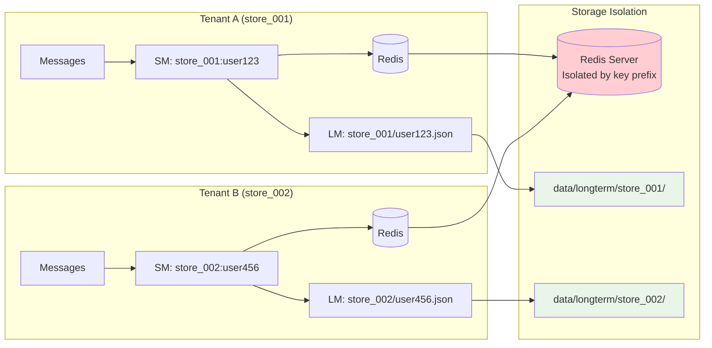
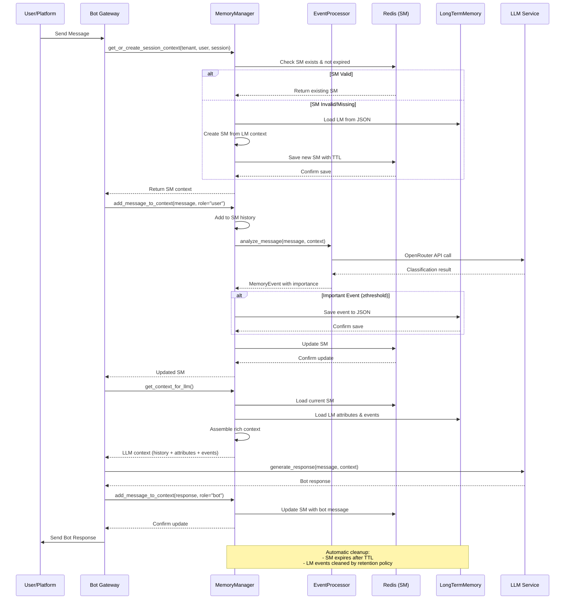

# Memory System Architecture & Flow

## Overview

The chat-chat memory system implements a dual-layer memory architecture designed for multi-tenant chatbot applications. It combines **Short-term Memory (SM)** for active conversation context and **Long-term Memory (LM)** for persistent user attributes and important events.

## Architecture Components

### Core Components

1. **MemoryManager** (`memory_manager.py`)
   - Central orchestrator for SM and LM operations
   - Handles memory lifecycle and data flow
   - Implements expiry-based memory reconstruction

2. **EventProcessor** (`event_processor.py`)
   - LLM-powered message analysis and classification
   - Importance scoring (0.0-1.0) for event filtering
   - Fallback mechanisms for robust operation

3. **LongTermMemoryStore** (`lm_json_store.py`)
   - JSON file-based persistent storage for LM
   - Event retention and cleanup policies
   - User attribute management

4. **Memory Models** (`models/memory.py`)
   - Pydantic models for type safety and validation
   - Domain-agnostic event structures
   - Multi-tenant data organization

## System Architecture Diagram



## Memory System Flow

### 1. Session Context Retrieval Flow



### 2. Message Processing Flow



### 3. LLM Context Generation Flow



### 4. Event Classification Flow



### 5. Multi-Tenant Data Flow



## Data Structures

### ShortTermMemory (Redis)

```python
{
    "tenant_id": "store_001",
    "user_id": "user123", 
    "session_id": "sess_20250730_001",
    "history": [
        {"role": "user", "message": "สวัสดีครับ"},
        {"role": "bot", "message": "สวัสดีค่ะ"}
    ],
    "summary": "User greeted, established communication",
    "state": "awaiting_input",
    "last_intent": "greeting",
    "variables": {
        "preferred_language": "th",
        "current_topic": "general"
    },
    "expires_at": "2025-07-30T12:00:00Z"
}
```

**TTL**: 30 minutes default (configurable)  
**Storage**: Redis with automatic expiry

### LongTermMemory (JSON Files)

```python
{
    "tenant_id": "store_001",
    "user_id": "user123",
    "events": [
        {
            "event_type": "INQUIRY",
            "payload": {
                "original_message": "ราคาสินค้านี้เท่าไหร่",
                "question_type": "pricing",
                "language": "th"
            },
            "importance_score": 0.8,
            "timestamp": "2025-07-30T10:30:00Z"
        }
    ],
    "attributes": {
        "preferred_language": "th",
        "customer_segment": "regular",
        "timezone": "Asia/Bangkok"
    },
    "history_summary": "Customer frequently asks about pricing"
}
```

**Persistence**: JSON files organized by tenant/user  
**Retention**: 365 days, 1000 events max per user

## Event Classification System

### Event Types (Domain-Agnostic)

| Type | Description | Examples |
|------|-------------|----------|
| `INQUIRY` | Questions, information requests | "ราคาเท่าไหร่?", "How does this work?" |
| `FEEDBACK` | Opinions, reviews, satisfaction | "ดีมาก", "Not satisfied with service" |
| `REQUEST` | Specific asks, assistance needs | "จองโต๊ะ", "Please help me with..." |
| `COMPLAINT` | Problems, issues, dissatisfaction | "สินค้าเสีย", "This doesn't work" |
| `TRANSACTION` | Purchase, payment, orders | "ซื้อ", "จ่ายเงิน", "Order #123" |
| `SUPPORT` | Help requests, guidance | "ช่วยได้ไหม", "I need assistance" |
| `INFORMATION` | Sharing details, providing data | "ที่อยู่คือ...", "My phone is..." |
| `GENERIC_EVENT` | General conversation | "สวัสดี", "Thank you" |

### Importance Scoring

| Score Range | Priority | Criteria | Action |
|-------------|----------|----------|---------|
| 0.9-1.0 | Critical | Transactions, urgent complaints | Always save to LM |
| 0.7-0.8 | Important | Specific requests, detailed feedback | Save to LM |
| 0.5-0.6 | Moderate | General support, basic inquiries | Save if above threshold |
| 0.3-0.4 | Low | Casual questions, general info | Usually filtered out |
| 0.1-0.2 | Minimal | Greetings, small talk | Filtered out |

## Configuration

### Memory Configuration

```python
MemoryConfig(
    redis_url="redis://localhost:6379/0",
    sm_ttl=1800,  # 30 minutes
    lm_base_path="data/longterm",
    max_events_per_user=1000,
    event_retention_days=365,
    importance_threshold=0.5  # Save events ≥ 0.5
)
```

### EventProcessor Configuration

```python
EventProcessor(
    api_key="your_openrouter_key",
    model="openai/gpt-4o-mini",  # Cost-optimized
    base_url="https://openrouter.ai/api/v1"
)
```

## Multi-Tenant Architecture

### Data Isolation

```
data/longterm/
├── tenant_001/
│   ├── user_001.json
│   ├── user_002.json
│   └── ...
├── tenant_002/
│   ├── user_001.json
│   └── ...
```

### Redis Key Structure

```
SM Keys: "sm:{tenant_id}:{user_id}"
Example: "sm:store_001:user123"
```

## API Usage Examples

### 1. Get Session Context

```python
memory_manager = MemoryManager(config)

# Get or create session context
sm = await memory_manager.get_or_create_session_context(
    tenant_id="store_001",
    user_id="user123", 
    session_id="sess_001"
)
```

### 2. Add Message

```python
# Add user message to context
sm = await memory_manager.add_message_to_context(
    tenant_id="store_001",
    user_id="user123",
    message="ราคาสินค้านี้เท่าไหร่ครับ",
    role="user",
    metadata={"platform": "line", "timestamp": "2025-07-30T10:30:00Z"}
)
```

### 3. Get LLM Context

```python
# Get formatted context for bot response
context = await memory_manager.get_context_for_llm(
    tenant_id="store_001",
    user_id="user123",
    include_summary=True,
    max_recent_messages=10
)

# Context includes:
# - recent_messages: Latest conversation
# - current_state: Session state
# - conversation_summary: LM summary
# - user_attributes: Persistent preferences
# - important_events: High-priority historical events
```

## Error Handling & Resilience

### Fallback Mechanisms

1. **LLM Failure**: Rule-based classification with keyword matching
2. **Redis Unavailable**: Create minimal SM for session continuity
3. **File I/O Errors**: Log errors, continue with available data
4. **Data Corruption**: Graceful degradation with empty structures

### Cleanup & Maintenance

```python
# Cleanup expired sessions
await memory_manager.cleanup_expired_sessions()

# Event retention (automatic during save)
# - Remove events older than retention_days
# - Keep only max_events_per_user most recent events
```

## Performance Considerations

### Optimization Strategies

1. **SM Caching**: Redis with TTL for fast access
2. **Lazy LM Loading**: Load LM only when SM expires
3. **Event Batching**: Process multiple events efficiently
4. **Async Operations**: Non-blocking I/O throughout
5. **JSON Optimization**: Atomic writes with temp files

### Scalability Features

- **Multi-tenant**: Isolated data per tenant
- **Horizontal Scale**: Redis clustering support
- **Storage Efficiency**: JSON compression options
- **Memory Limits**: Configurable event limits per user

## Integration Points

### Bot Gateway Integration Flow



### Code Integration Example

```python
# In bot message handler
memory_manager = MemoryManagerFactory.create_from_config(config)

# Get context for incoming message
sm = await memory_manager.get_or_create_session_context(
    tenant_id=store.id,
    user_id=user.id,
    session_id=session.id
)

# Add user message
await memory_manager.add_message_to_context(
    tenant_id=store.id,
    user_id=user.id,
    message=incoming_message.text,
    role="user"
)

# Get context for LLM
llm_context = await memory_manager.get_context_for_llm(
    tenant_id=store.id,
    user_id=user.id
)

# Generate bot response with context
bot_response = await llm_service.generate_response(
    message=incoming_message.text,
    context=llm_context
)

# Add bot response to memory
await memory_manager.add_message_to_context(
    tenant_id=store.id,
    user_id=user.id,
    message=bot_response,
    role="bot"
)
```

## Future Enhancements

### Planned Features

1. **Memory Summarization**: Periodic LM summarization for efficiency
2. **Attribute Extraction**: Automatic user preference learning
3. **Cross-Session Analytics**: User behavior pattern analysis
4. **Memory Compression**: Efficient storage for large histories
5. **Real-time Updates**: WebSocket-based memory synchronization

### Advanced Capabilities

- **Semantic Search**: Vector-based event similarity search
- **User Clustering**: Similar user pattern identification
- **Predictive Context**: Proactive context preparation
- **Memory Migration**: Cross-platform user data portability